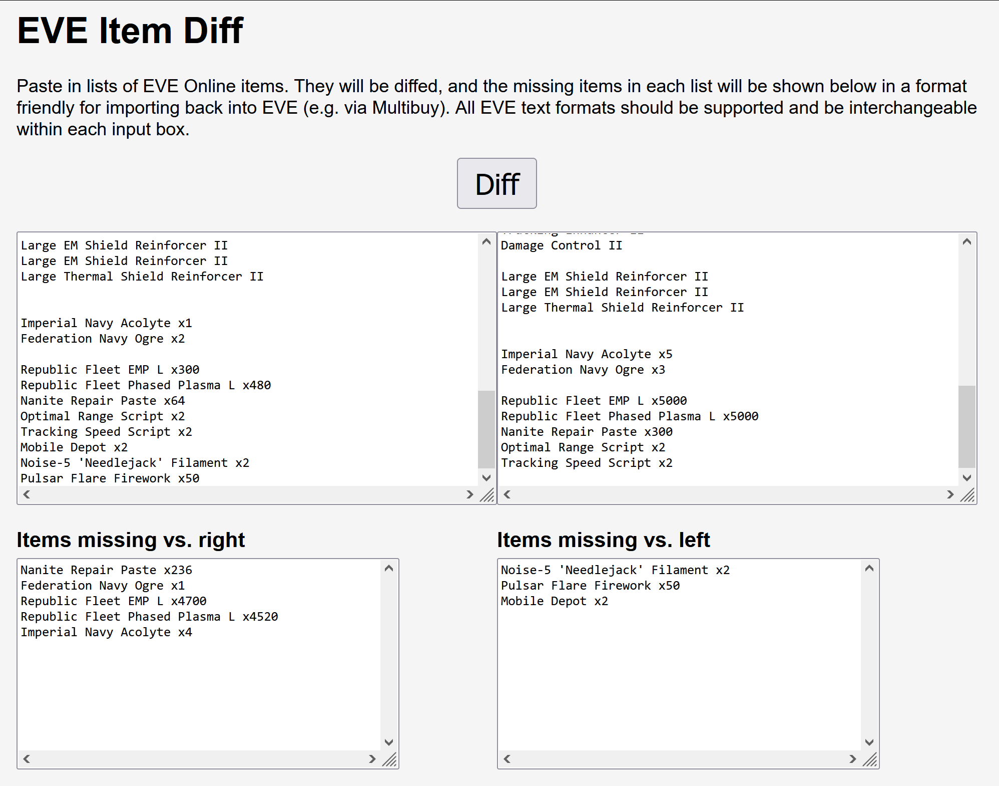

# EVE item diff

Item list diffing for EVE Online. Mainly developed for diffing fits, but
applications may be broader. The parser is packaged separately at
[michaelmdresser/eve_item_parser](https://github.com/michaelmdresser/eve_item_parser). A practical application of
diffing can be found at the [EVE Item Diff](https://michaelmdresser.com/eve-item-diff.html) site.

## WASM

The `diff()` function is packaged via WASM in the appropriate subdirectory.
Instructions for building and using can be found there.
